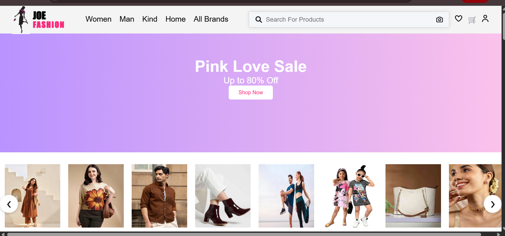
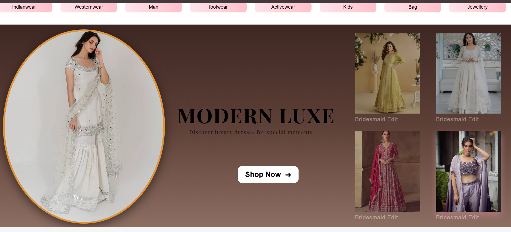
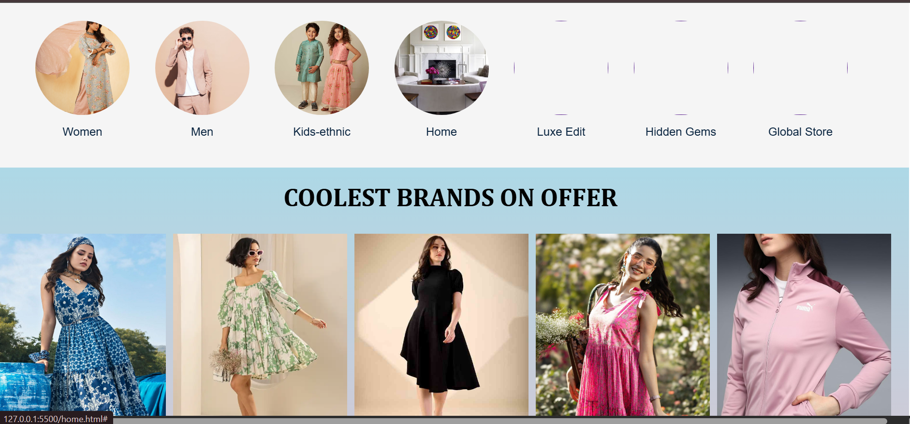
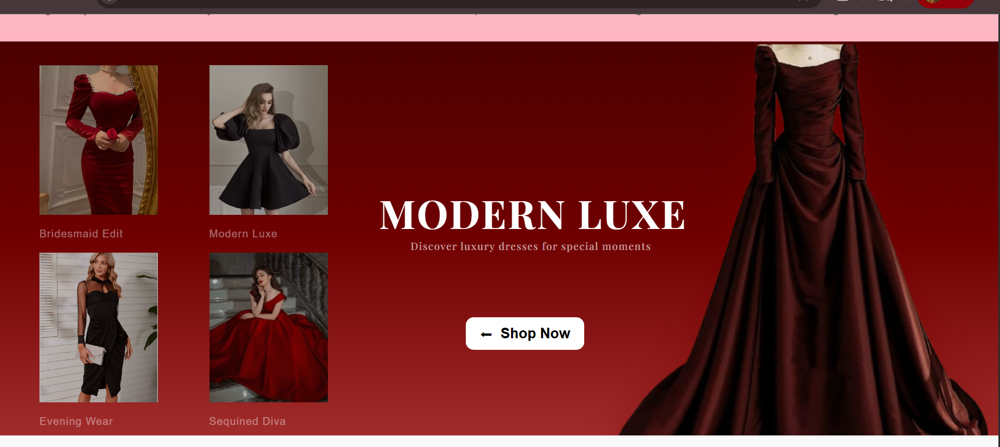

# 👗 JoeFashion - Fashion Ecommerce UI Project

## 📌 Description
JoeFashion is a modern fashion ecommerce **UI practice project** built using HTML, CSS, and JavaScript.  
This project is focused only on frontend design and layout for learning and practice purposes.

---

## 🎯 Purpose
This project was created to:
- Practice HTML, CSS, and JavaScript
- Improve frontend UI/UX skills
- Learn responsive web design
- Build ecommerce layout structure

---

## 🚀 Features
- Responsive homepage UI  
- Fashion product listing design  
- Multiple product pages  
- Cart page UI (static)  
- Clean and modern UI design  
- Beginner-friendly frontend project  

---

## 📸 Screenshots

### 🏠 Home Page


---

### 👗 Product Page


---

### 👕 Product Page 2


---

### 🛒 Product Page 3


---

## 🛠️ Tech Stack
- HTML  
- CSS  
- JavaScript (basic)

---

## ⚠️ Note
This is a **frontend UI practice project only**.  
No backend, database, or real ecommerce functionality is implemented.

---

## 📌 How to Run
1. Clone repository:
```bash
git clone https://github.com/your-username/JoeFashion.git
